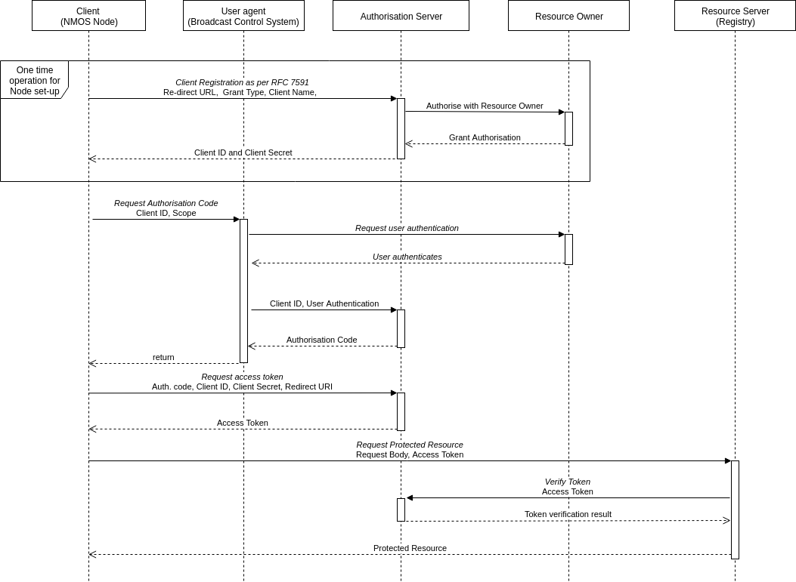

# AMWA IS-10 NMOS Authorization Specification: Overview

_(c) AMWA 2019, CC Attribution-ShareAlike 4.0 International (CC BY-SA 4.0)_

## Documentation

The documents included in this directory provide additional details and recommendations for implementations of the defined API, and its consumers.

## Use of Normative Language

The key words "MUST", "MUST NOT", "REQUIRED", "SHALL", "SHALL NOT", "SHOULD", "SHOULD NOT", "RECOMMENDED", "MAY", and "OPTIONAL" in this document are to be interpreted as described in [RFC 2119][RFC-2119].

## Definitions

_See also the [NMOS Glossary](https://github.com/AMWA-TV/nmos/wiki/Glossary), and definitions within RFCs._

## Introduction

The purpose of this document is to describe how to implement client registration and user authorization for the NMOS APIs.  

Use of insecure communication (plain HTTP etc.) is forbidden within the scope of this document.

Implementation of [BCP-003-01](best-practice-secure-comms.md) is a RECOMMENDED prerequisite to implementing this document.

The Authorization Server SHALL present an instance of the NMOS [Authorization API](APIs/AuthorizationAPI.raml).

The Authorization Server MAY present multiple versions of the API on the same port, but MUST name-space them accordingly as per the API specification.

The Authorization Server must otherwise be implemented as per [RFC 6749][RFC-6749].

## API Structure

The base of the api can be found at:

```
https://<ip address or hostname>:<port>/x-nmos/auth/<api version>/
```

The primary endpoints used for interaction with the Authorization Server include:

- **register_client** - used for the manual or dynamic registration of an OAuth 2.0 client with the Authorisation Server in line with [RFC 7591](https://tools.ietf.org/html/rfc7591).
- **authorize** - used for requesting an authorization code when using the authorization code grant.
- **token** - used for requesting a token when using any of the chosen grant types.
- **revoke** - used as the revocation endpoint for revoking currently active access tokens or refresh tokens.
- **certs** - used to expose the certificate containing the public key  that corresponds with the private key used to sign the access tokens.

## API Interaction

<p align="center">

</p>
