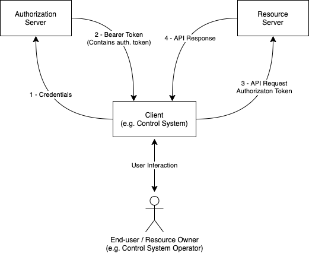

# AMWA IS-10 NMOS Authorization Specification: Overview

_(c) AMWA 2019, CC Attribution-ShareAlike 4.0 International (CC BY-SA 4.0)_

## Documentation

The documents included in this directory provide additional details and recommendations for
implementations of the defined API, and its consumers.

Familiarity with the [JT-NM reference architecture](http://jt-nm.org/) is assumed, and further
definitions of OAuth 2.0 concepts as they apply to NMOS are found in both the
[Definitions](./5.0.%20Definitions.md) section and the [OAuth 2.0 spec][RFC-6749].

## Use of Normative Language

The key words "MUST", "MUST NOT", "REQUIRED", "SHALL", "SHALL NOT", "SHOULD", "SHOULD NOT",
"RECOMMENDED", "MAY", and "OPTIONAL" in this document are to be interpreted as described in [RFC
2119][RFC-2119].

## Introduction

This document covers the mechanism by which access tokens are requested from an Authorization Server,
against which an AMWA NMOS API Resource Server may verify that a client and/or user accessing it has
the privileges required to access or modify some or all of the content using the API.

Use of insecure communication (plain HTTP etc.) is forbidden within the scope of this document.
Whilst this document is not concerned with the security of the connection used to carry out
authorization or subsequently authorised interactions, for the authorization mechanisms described in
this document to be effective the connection used MUST be secured.

Implementation of [BCP-003-01][BCP-003-01] is a RECOMMENDED prerequisite to implementing this
document.

## Authorization Flow (informative)

A simplified illustration of the authorization flow is shown below. The API client, in this case a
broadcast control system, provides credentials to the Authorization Server, which
verifies them. These credentials consist of information pertaining to the client itself, given by the
Authorization Server upon successful registration, and to the user. The mechanism used to verify credentials
is out of scope for this document, but may involve widely used authentication technologies such as a corporate
Single Sign On, Kerberos or Microsoft Active Directory for example.

In its request, the client will also indicate what privileges it wants included in a token. If the
Authorization Server concurs that a given client may be permitted the privileges requested, it will
grant a Bearer Token containing an Authorization Token whose "claims" include the requested
privileges.

The client uses the Authorization Token it has been issued with when it makes requests to protected
resources on the Resource Server. The Resource Server then validates the token, using the public key
of the Authorization Server. If the Resource Server finds that the token is valid for the protected
resource to be accessed, it will allow the API request to proceed.

Tokens are signed using a long-lived private key held by the Authorization Server. The Authorization
Server makes available its public key to Resource Servers, to allow them to validate tokens using
that key.

Access tokens are short-lived for security purposes. To prevent multiple authorization requests to the user, OAuth
2.0 supports the  concept of Refresh tokens. Refresh Tokens issued by the Authorization Server are much
shorter-lived than the Authorization Server secret key, but longer-lived than the Access Token. This means that the
client may readily employ the access token without needing to ask the end-user for their credentials, but allows
system administrators the opportunity to revoke access to the protected resources by the client by refusing
to issue a new access token when asked for a renewal.

## OAuth Grants

### Client Types (Informative)

[RFC-6749] defines three different classes of OAuth 2.0 Client:
- **Web application** - client credentials stored in a server.
- **User-agent-based application** - client credentials stored in the user-agent (e.g browser).
- **Native application** - client credentials stored in a native application (e.g broadcast control
  system).

It is important to understand what kind of client is being implemented, as this impacts on the OAuth
2.0 grant that it may use.

In the [JT-NM Reference Architecture](http://jt-nm.org/RA-1.0/), clients are the consumers or modifiers of NMOS
APIs, typically Broadcast Control Systems when using Connection Management (IS-05), or NMOS Nodes, when using
Discovery & Registration (IS-04).

A broadcast control system that is built as a native app is a "Native Application" type, and
a control system implemented in a browser is a "User-agent-based application", and they should be
treated accordingly when implementing OAuth. [RFC-6749] defines both these client types to
be _Public Clients_.

Out of these three client types an NMOS Node most closely resembles a web application, because client
credentials are not stored in the user-agent or a native application. Instead they are stored on a server away from
the resource owner. The web application client type is the only OAuth 2.0 client type where this is permitted to be
the case. [RFC-6749] considers such clients to be _Confidential Clients_.

### Grant Types (Informative)

OAuth 2.0 defines several different grant types:

- Authorization Code Grant
- Implicit Grant
- Resource Owner Password Credentials Grant
- Client Credentials Grant
- Refresh Token Grant

The authorization code grant is optimised for confidential clients, and is recommended where possible for all NMOS
interactions. For use with public clients, such as control system type clients, the use of Proof Key for
Code Exchange (PKCE), outlined in [RFC7636][RFC-7636], should be used. The authorization Code grant is a
redirection-based grant flow. Upon successful submission of client credentials, user authorization is requested by the
Authorization Server using a HTML web page, native application page, etc, for the given set of requested scopes.
Upon user consent, the user is redirected to the client's registered redirect URI, with an authorization code in
the query parameters. This code is subsequently used by the client to gain a Bearer Token.

For browserless and input-restricted devices, the Device Authorization Grant described in [RFC-8628] should be used.

The implicit grant, password credentials grant, and client credentials grant have now been deprecated in use by the
IETF's [Best Common Practices][oauth-bcp-13], being replaced with the authorization code grant flow using PKCE.

The implicit grant was originally designed for use with public clients and Single Page Web Applications who could
not feasibly keep their client credentials safe. This redirection grant issued the access token in the redirection
URI and was susceptable to access token leakage and access token replay attacks described in the IETF's
[Best Common Practices][oauth-bcp-13].

The resource owner password credentials grant was designed for situations where the resource owner had a strong
trust relationship with the client - this was typically reserved for first-party software applications. This grant
has been deprecated, due to the anti-pattern of submitting user credentials to the client, and is liable to phishing
attacks.

The client credentials grant was designed for confidential clients, but requires the resource owner
arrange for the Authorization Server to allow access to protected resources out of band of the authorization process.
This grant is usually used in machine-to-machine operations in which there is no concept of a user.

The refresh token grant is used when the client has been given a refresh token as part of a successful bearer token
request. This allows a client to request further access tokens without passing in user credentials or getting user
authorization. The refresh token should be bound to the client to which it was given, and bound to the same scopes
that were approved during the authorization request.

Individual AMWA NMOS specifications may specify the grants permitted for the API clients involved in
the specification, however the guidance above for the suitability of different grants for use with
certain clients should be followed. Unless otherwise specified by the AMWA NMOS Specifications it
supports, an Authorization Server SHOULD support at least the Authorization Code Grant.

[RFC-2119]: https://tools.ietf.org/html/rfc2119 "Key words for use in RFCs"

[RFC-6749]: https://tools.ietf.org/html/rfc6749 "The OAuth 2.0 Authorization Framework"

[RFC-7523]: https://tools.ietf.org/html/rfc7523 "JSON Web Token (JWT) Profile"

[RFC-7636]: https://tools.ietf.org/html/rfc7636 "Proof Key for Code Exchange by OAuth Public Clients"

[RFC-8628]: https://tools.ietf.org/html/rfc8628 "OAuth 2.0 Device Authorization Grant"

[BCP-003-01]: https://github.com/AMWA-TV/nmos-api-security/blob/v1.0-dev/best-practice-secure-comms.md

[oauth-bcp-13]: https://tools.ietf.org/html/draft-ietf-oauth-security-topics-13 "OAuth 2.0 Security Best Current Practice 13"
