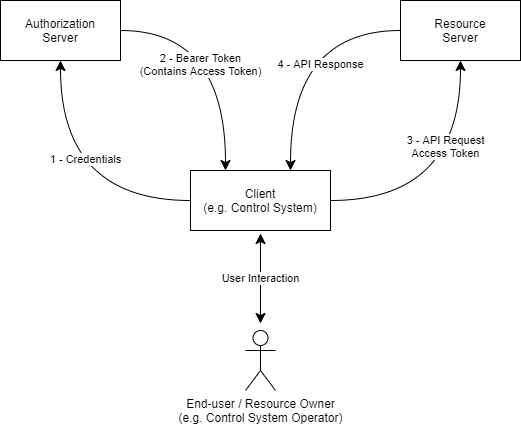

# AMWA IS-10 NMOS Authorization Specification: Overview

_(c) AMWA 2019, CC Attribution-ShareAlike 4.0 International (CC BY-SA 4.0)_

## Documentation

The documents included in this directory provide additional details and recommendations for implementations of the defined API, and its consumers.

Familiarity with the [JT-NM reference architecture](http://jt-nm.org/) is assumed, and further definitions of OAuth 2.0 concepts as they apply to NMOS are found in both the [Definitions](./5.0%20Definitions) section and the [OAuth 2.0 spec][RFC-6749].

## Use of Normative Language

The key words "MUST", "MUST NOT", "REQUIRED", "SHALL", "SHALL NOT", "SHOULD", "SHOULD NOT", "RECOMMENDED", "MAY", and "OPTIONAL" in this document are to be interpreted as described in [RFC 2119][RFC-2119].

## Introduction

This document covers client authorization, the mechanism by which an AMWA NMOS API Resource Server may verify that a client accessing it has the privileges required to access or modify some or all of the content using the API.

Use of insecure communication (plain HTTP etc.) is forbidden within the scope of this document. Whilst his document is not concerned with the security of the connection used to carry out authorization or subsequently authorised interactions, for the authorization mechanisms described in this document to be effective the connection used MUST be secured.
Implementation of [BCP-003-01][BCP-003-01] is a RECOMMENDED prerequisite to implementing this document.

The Authorization Server SHALL present an instance of the NMOS [Authorization API](../APIs/AuthorizationAPI.raml).

The Authorization Server MAY present multiple versions of the API on the same port, but MUST name-space them accordingly as per the API specification.

The Authorization Server and client authentication methods MUST otherwise be implemented as per the OAuth 2.0 Authorization Framework [RFC 6749][RFC-6749]. All tokens produced by the Authorization Server MUST be Bearer Tokens using the JSON Web Token (JWT) profile as per [RFC 7523][RFC-7523].

## Authorization Flow (informative)

A simplified illustration of the authorization flow is shown below. The API client, in this case a broadcast control system, provides the client's credentials to the Authorization Server, which verifies them. The mechanism used to verify client credentials is out of scope for this document, but may involve widely used authentication technologies such as a corporate Single Sign On, Kerberos or Microsoft Active Directory for example.

In its request, the client will also indicate what privileges it wants included in a token. If the Authorization Server concurs that a given client may be permitted the privileges requested, it will grant a Bearer Token containing an Authorization Token whose "claims" include the requested privileges.

The client uses the Authorization Token it has been issued with when it makes requests to protected resources on the Resource Server. The Resource Server then validates the token, using the public key of the Authorization Server. If the Resource Server finds that the token is valid for the protected resource to be accessed, it will allow the API request to proceed.

Tokens are signed using a long-lived private key held by the Authorization Server. The Authorization Server makes available its public key to Resource Servers, to allow them to validate tokens using that key.

The Bearer Token issued by the Authorization Server are much shorter-lived than the Authorization Server secret key, but longer-lived than the Access Token. This means that the client may readily employ the access token without needing to ask the end-user for their credentials, but allows system administrators the opportunity to revoke access to the protected resources by the client by refusing to issue a new access token when asked for a renewal.

[RFC-2119]: https://tools.ietf.org/html/rfc2119 "Key words for use in RFCs"

[RFC-6749]: https://tools.ietf.org/html/rfc6749 "The OAuth 2.0 Authorization Framework"

[RFC-7523]: https://tools.ietf.org/html/rfc7523 "JSON Web Token (JWT) Profile"

[BCP-003-01]: https://github.com/AMWA-TV/nmos-api-security/blob/v1.0-dev/best-practice-secure-comms.md
