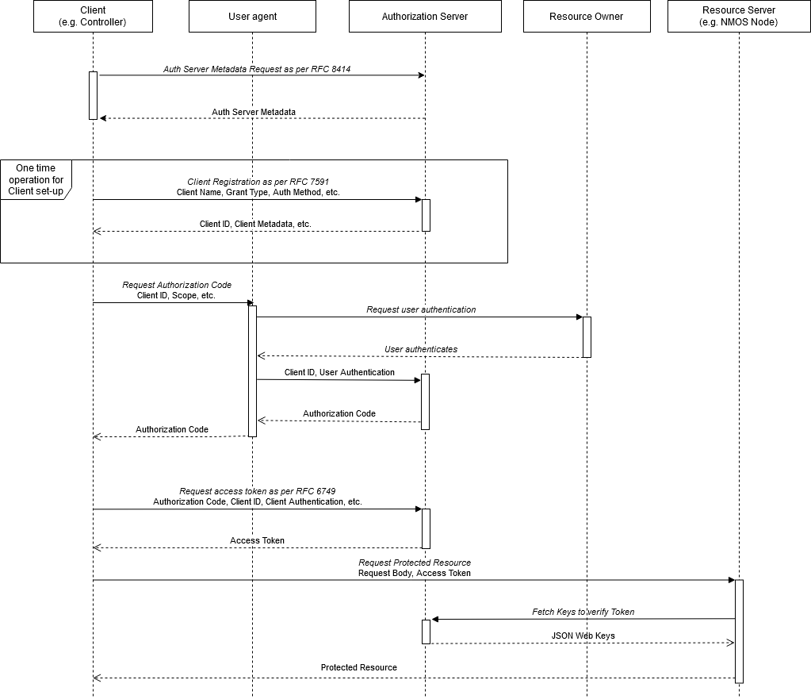

# APIs

_(c) AMWA 2019, CC Attribution-NoDerivatives 4.0 International (CC BY-ND 4.0)_

This document covers common aspects of the following API, and how other AMWA NMOS APIs and their clients interact with
it:
*   [Authorization API](../APIs/AuthorizationAPI.raml)

The Authorization API specified above is one valid implementation, but does not define how every Authorization Server
will present itself. Any OAuth 2.0 compatible Authorization Server which implements the RFCs noted in the
[Overview](1.0.%20Overview.md) is compatible with this authorization mechanism.

## API Specifications

The Authorization API is specified using:
*   The following sub-sections describing the API and its associated IETF RFCs.
*   Example [RAML](http://raml.org/) documents and [JSON schemas](http://tools.ietf.org/html/draft-zyp-json-schema-04)
in the [APIs](../APIs/) folder.
*   Examples of JSON format output are provided in the [examples](../examples/) folder.

The Authorization Server SHALL present an instance of the NMOS [Authorization API](../APIs/AuthorizationAPI.raml). The API
MAY use alternative paths for all endpoints other than those beginning with `.well-known`, provided the alternative
paths are correctly signalled via OAuth 2.0 Authorization Server Metadata [RFC 8414][RFC-8414].

The Authorization Server and client authentication methods MUST otherwise be implemented as per the OAuth 2.0
Authorization Framework [RFC 6749][RFC-6749]. All access tokens produced by the Authorization Server MUST be Bearer
Tokens using the JSON Web Token (JWT) format as per [RFC 7519][RFC-7519].

## API Paths

The Authorization Server MUST have have an "issuer identifier" URL, as defined by [RFC 8414][RFC-8414].
This MAY follow the path structure defined by other NMOS specifications, but this is not mandatory:

```
https://<ip address or hostname>:<port>/x-nmos/auth/<api version>/
```

Any path component of the issuer identifier (omitting the initial `/` and any trailing `/`) is advertised via the DNS-SD
`api_selector` TXT record, as described in [Discovery](3.0.%20Discovery.md). In this example, it would be
`x-nmos/auth/<api version>`.

The issuer identifier MAY be used as the base of the Authorization API, but this is not mandatory.
The server identifies the paths for its Authorization API endpoints as follows.  

### Server Metadata Endpoint

The Authorization Server MUST implement an endpoint at the following path. This path immediately follows the port and
MUST NOT be prefixed by any additional path, including but not limited to 'x-nmos'. This endpoint cannot follow the
usual format of NMOS APIs since it MUST follow the syntax and semantics of ".well-known" endpoints defined in
[RFC 5785][RFC-5785].

*   **/.well-known/oauth-authorization-server\[/<api_selector>\]** - This path MUST return a response matching the
requirements of OAuth 2.0 Authorization Server Metadata [RFC 8414][RFC-8414]. This MUST include the optional
`jwks_uri` and `registration_endpoint` parameters. The `revocation_endpoint` SHOULD be supported.

### Authorization Endpoints

The following endpoints MUST be implemented by an Authorization Server at the paths signaled in the Authorization
Server Metadata.

*   The `authorization_endpoint`, for example at **/authorize** - Used for requesting an authorization code when
    using the authorization code grant, as defined by [RFC 6749][RFC-6749].
*   The `token_endpoint`, for example at **/token** - Used for requesting a token when using any of the chosen grant
    types, as defined by [RFC 6749][RFC-6749].
*   The `jwks_uri` endpoint, for example at **/jwks** - Used to expose a JSON Web Key Set [RFC 7517][RFC-7517]
    containing the public key that corresponds with the private key used to sign the access tokens.
*   The `registration_endpoint`, for example at **/register** - Used for the manual or dynamic registration of an
    OAuth 2.0 client with the Authorization Server in line with [RFC 7591][RFC-7591].

## API Interaction



## API Validation

JSON schemas are included with the RAML API definitions. These include validation for values used within the APIs.
These are based on the schemas defined in the [OAuth 2.0 Specification][RFC-6749]. It is RECOMMENDED that implementers
of the Authorization API use these JSON schemas as part of a validation stage when passing client registration data
to, or receiving client and token data from, the Authorization Server.

### Content Types

All API endpoints returning a JSON response MUST provide a JSON representation signalled via `Content-Type:
application/json` headers. This SHOULD be the default content type in the absence of any requested alternative by
clients. Other content types (such as HTML) are permitted if they are explicitly requested via Accept headers.

For HTTP redirections, such as when using the Authorization Code Grant, a Content-Type of `text/html` MAY also be
returned.

### Cache-Control

The authorization server MUST include the HTTP "Cache-Control" response header field with a value of "no-store" in any
response containing tokens, credentials, or other sensitive information, as well as the "Pragma" response header field
with a value of "no-cache", in line with [RFC 6749][RFC-6749].

### Redirections

Some of the standard grants used within the OAuth 2.0 framework make use of user-agent redirection (e.g. via a
web-browser) in order to gain user authorization. The primary grants that make use of redirection are the Authorization
Code Grant and the Implicit Grant. As such, clients performing requests using these methods MUST correctly handle a 302
response (Found) as stated in Section 4.1.2 of [RFC 6749][RFC-6749] following the guidelines given in
[RFC 7231][RFC-7231].

The Authorization Server MUST NOT use the 307 HTTP status code for redirection as per Section 4.10. of the [OAuth
2.0 Best Common Practice][oauth-security-topics] draft.

### OPTIONS Requests

OAuth 2.0 Clients MUST support pre-flight OPTIONS requests when performing all HTTP requests, including GET requests,
as the presence of the `Authorization` HTTP header used to send the access token creates a "non-simple" request, in
line with the W3C's [Cross-Origin Resource Sharing][cross-origin] specification.

OPTIONS requests MUST NOT require authorization, such as the presence of an access token inside the `Authorization`
header.

The Authorization Server and Resource Servers MUST correctly reply to OPTIONS requests across all API endpoints,
explicitly permitting the use of the `Authorization` header inside the `Access-Control-Allow-Headers` field.

### Error Codes & Responses

The NMOS APIs use HTTP status codes to indicate success, failure and other cases to clients as per [RFC 7231][RFC-7231]
and related standards.

Authorization Servers MUST return error codes and responses in line with Section 5.2. of [RFC 6749][RFC-6749]. OAuth
2.0 Clients MUST be capable of handling such responses.

Resource Servers MUST return error codes and responses in line with Section 3 of [RFC 6750][RFC-6750]. OAuth 2.0
Clients MUST be capable of handling such responses.

Further details on when Resource Servers will respond with particular codes is covered in
[Resource Servers - Accessing Protected Resources](4.5.%20Behaviour%20-%20Resource%20Servers.md#accessing-protected-resources).

Where the RAML specification of an API specifies explicit response codes it is expected that a client will handle these
cases in a particular way. As explicit handling of every possible HTTP response code is not expected, clients must
instead implement more generic handling for ranges of response codes (1xx, 2xx, 3xx, 4xx and 5xx).

[RFC-5785]: https://tools.ietf.org/html/rfc5785 "Defining Well-Known Uniform Resource Identifiers (URIs)"

[RFC-6749]: https://tools.ietf.org/html/rfc6749 "The OAuth 2.0 Authorization Framework"

[RFC-6750]: https://tools.ietf.org/html/rfc6750 "The OAuth 2.0 Authorization Framework: Bearer Token Usage"

[RFC-7009]: https://tools.ietf.org/html/rfc7009 "OAuth 2.0 Token Revocation"

[RFC-7231]: https://tools.ietf.org/html/rfc7231#section-6.4.3 "Hypertext Transfer Protocol (HTTP/1.1): Semantics and Content"

[RFC-7517]: https://tools.ietf.org/html/rfc7517 "JSON Web Key (JWK)"

[RFC-7519]: https://tools.ietf.org/html/rfc7519 "JSON Web Token (JWT)"

[RFC-7591]: https://tools.ietf.org/html/rfc7591 "OAuth 2.0 Dynamic Client Registration Protocol"

[RFC-8414]: https://tools.ietf.org/html/rfc8414 "OAuth 2.0 Authorization Server Metadata"

[oauth-security-topics]: https://datatracker.ietf.org/doc/draft-ietf-oauth-security-topics/ "OAuth 2.0 Security Best Current Practice 13"

[cross-origin]: https://www.w3.org/TR/cors "Cross-Origin Resource Sharing"
